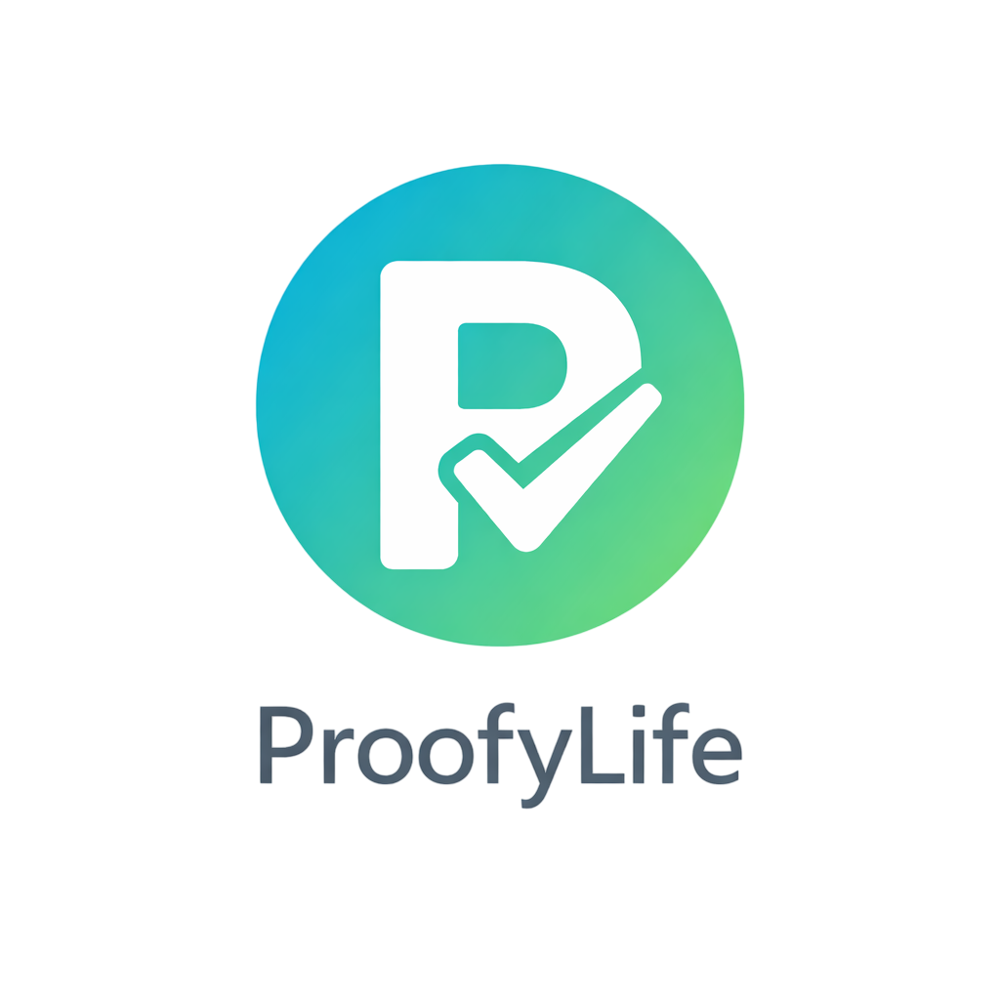
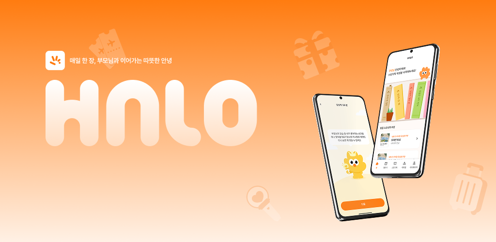

<!-- ANIMATED HEADER -->

 

<!-- TYPING ANIMATION -->

 

<!-- PROFILE BADGES -->

&nbsp;

---

 

## 🧑‍💻 About Me

> **기능을 구현하는 것에서 끝나지 않고,**
> 그 기능이 **운영 환경에서 어떻게 동작하고 유지되는지**를 함께 고민하며 프로젝트를 진행해 왔습니다. 
> 현재 **홍익대학교 컴퓨터공학과 3학년 재학 중**이며 웹 개발, 웹 보안, 네트워크, 서버, 기획 등 다양한 직무로 프로젝트를 진행하며 견문을 넓히는 중입니다.

 

---

## 🛠 Tech Stack

### Backend · Server

### Frontend

### Database

### OS · Infra

### Deployment · Tools

 

---

## 📜 Certifications

| 🏅 자격증 | 분야 |
|:---:|:---:|
|  | 데이터베이스 |
|  | OS · 시스템 |
|  | 네트워크 |
|    | Cloud · AI |

 

---

## 🗂 Projects

  
| 프로젝트 | 규모 | 내 역할 | 설명 | 상태 | 링크 |
|:---:|:---:|:---:|:---|:---:|:---:|
|  <b>밥세권</b> | Team (5) | Full Stack | 소상공인 재고 최적화 및 가성비 픽업 서비스 · 보안 실무자 피드백 |  |  |
|  <b>YIT</b> | Team (6) | Linux(Network)·PM | 가상 대학교 인프라 · 네트워크 설계 |  |  |
|  <b>푸드파이터</b> | Team (6) | Linux(Security) | 밥세권 서비스 인프라 재구축/보안 컨설팅/모의해킹 · 보안 실무자 피드백 |  |  |
|  <b>ProofyLife</b> | Solo | Full Stack | 개인 기록 · 포트폴리오 기록 플랫폼 |  | 서버종료 |
|  <b>Bookmarker</b> | Solo | Full Stack | PHP 및 FTP 활용 로그인 기반 북마크 관리 서비스 |  | 서버종료 |
|  <b>FutureBox</b> | Solo | Full Stack | 미래의 나에게 보내는 타임캡슐 서비스 |  |  |
|  <b>FortuneBear</b> | Solo | Full Stack | Node.js 기반 운세 실험 프로젝트 |  |  |
|  <b>CustomQR</b> | Solo | Full Stack | 계절 테마 3D QR 생성 및 PNG 내보내기 |  |  |
|  <b>QuizAI</b> | Team (3) | Frontend | AI 기반 실시간 퀴즈 및 학습 분석 서비스 · KIT 공모전 출품 |  |  |
|  <b>물꼬</b> | Team (5) | Frontend | 실시간 교육 질문 플랫폼 · 멋쟁이사자처럼 애거돈 🥇1위 |  |  |
|  <b>HALO</b> | Team (10) | Plan·PM | 스토리북을 통해 부모님의 취향과 삶을 알아가고, 일상 속 작은 효도를 꾸준히 실천할 수 있도록 돕는 가족 관계 서비스 |  |  |
|  <b>IndieFilm</b> | Team(3) | Full Stack·PM | 인디 영화 제작 및 활영 통합 플랫폼 |  |  |

---

 

## 🔗 Portfolio & Content

| 구분 | 설명 | 링크 |
|:---|:---|:---:|
| 🌐 **Portfolio Site** | 전체 프로젝트 · 인프라 · 보안 경험 정리 |  |
| ✍️ **Tech Blog** | 개발 · 서버 · 보안 학습 기록 |  |

---

## 📊 GitHub Stats

  

  

  

 

---

### 🔗 Contact & Links

 

